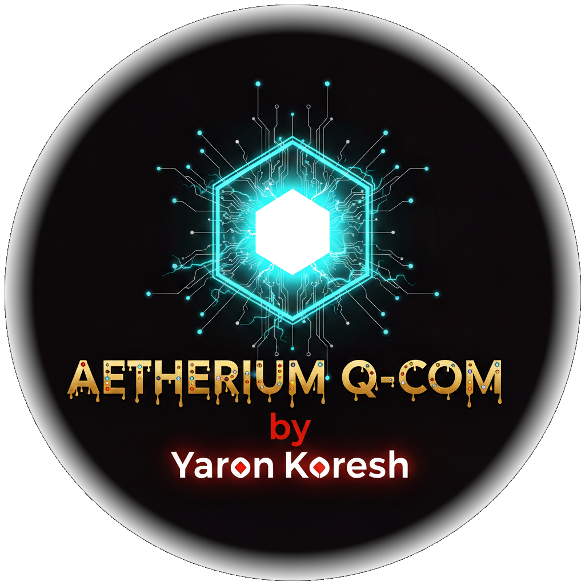

  
  <h3><i>Decentralized, Untraceable, and Unblockable Communication</i></h3>
  

    
    
    
    

 

Aetherium Q-Com is a <strong>zero-trust</strong> communication platform engineered for truly private, censorship-resistant messaging. It establishes direct, peer-to-peer connections that are invisible to network monitoring and fortified with a robust, code-level cryptographic integrity system.

    

<blockquote style="border-left: 4px solid #F85149; padding-left: 16px; color: #ADBAC7;">
  <h2 style="color: #F85149;">⚠️ IMPORTANT: CLIENT INTEGRITY WARNING ⚠️</h2>
  This project is open-source.
   
  To protect against malicious versions, the client cryptographically verifies its own code integrity on every launch.
   
  <strong>Your safety depends on trusting the developer, not the download source.</strong>
    
  Ensure the <code>dev_public.key</code> file in your client's directory matches the official public key.
   
  For quick verification, check that the key you downloaded <strong>ends with:</strong> <code>WW2SSgQC</code>
  

    
Click to view the full official public key

    <pre><code>A+NltCBFPGuRYgxJWtT4RoZSuFIidRxi9TEFLVA2nuCXLhGkPAagixlwh9iFAqA/tmWlHtEG0ggqaOWrEC0FvE0AeJ5UV9WqecN8RYpwW+OjEI97cbUdYl1qbTkl6j5grJCkLBf8rse0iSY22xZU8FlMbB8QwaV4yBrA9Svvv31u3q2FN4tgd2diZ80fUf6FrbSgx+3FTwg0Ilv4FQZmDYeec5EfHhah4j5PftZPfIdhMGViFVkfMveCcj3ctozru1LPQNPiiZCAfOkkxc6E+hK/o6HNEkHFxCZSuu0gmMGMS/dQjku2/PUPe/qQ/rGdkKKBDJCwJ/BOiXMWQP4vKM25ATZNWiIFA+j1Wxq4xc/OSwsDN4+1iji/edUMDvYR/vKHfd35CWuvPmzqrcJ5+DARd8GzRaT5yK/s07EaiF47uD19LmdeED9cI0NxkmjyWPFmMWXX70IcEidC29l1TTiMnaWa2x2kTGUl6AXBx7Fy+xORsyh7H4ZOAAt28C+h0LDwweTiMKnn7PKMtuxhEUsyHEzYDo2YnFEfsX0yJR6SEXpw/iSmDfNDqZKygom4z2CSGr76+eLpUf1mnEEUsPftBjFpElos39pLieBPorXtsYa3OvXPQI7jqLBLzR1ZxN/Zqq81fgzjv3BUZGifeJaYzAmQm+7CUffVYYiCblZp/XkUlqOvIprL8ez4x668yApV9ha9VbawcQzFqljYDUEenKcVEJxmi9IpaBgU9gSnN0BaIrcnuzvGCicQELDNTJpDSlekmUmW54bEfsfbaoltRpMDakTARNK2HErxzQ0qtFhQDzRsabMoXBBIECe4U9tJUG5BjPtoNJVqu7VibLRTfmwVuPNR+LldvKAPFrwm9OMsmKRQFqk6Xcm3DftnjTvU7R+ldBsidTofyYKlXAqvyO72NcMPVhCvvf1zKXWq7yAu4VmKcBFVF1mBZa0pZCEs7dIyTQxRoDAKrl+mkG08TMJbYSxMt5ugcWup/Y+2nRH/jtM0664xAZVv0LEKSdY7TTn0/i2FoPiS8V3EgRFhIJ0q51JSNQx6PmvtIyOu5dwhZ6+GIDohyfTa1waLIYoDl9ivPUZr90ouXrKy8s2UVqU6iDH1KAPIyOwTY7LcsumKuHM5Xu9bLOfegSka1+qpEBGxL290OIGtziCZ44XEOPjcGBdYKnYqbU5w14EiGXnPbyXD9Vp+FwNbRlooxlOlqPg6PMwFDtltvDjnkLyJiRrVPkho12PhlOmA8XLxUowP4W7lnidsY7EoFss8Aw+p7by/mVReqF+ZnwXxWt6FlN6KQQmdrCZlcYcUv57uX8AQn5cSa1ZYRfIWh4H7SQS6N7yHYsZoas5hdxb/FuMwq0JwzXr5yr5XQaYhnF36N1kmuJsjsmcKwIQs/Y48bY8oDIsvvla3oLBktD0gLDcg9SJn7IVKyelgVhDZLYrzVWC8+jrZMNPaK6INzICnJqoips9UJp0V0g4OUMqRnDYBnqrEOf0hhLlXbN4eBTJ0498BjsrWIqFBRtjikoyYLRAivqL/zRAzc0Y21Itv4+RLLquFPW3tnPB4jcRzkWWmAukCfdA1Ch5204z91eFix1Y2UfcRHI7o41ZPCjX/18WP69kRPI2nkRMFT5Dv+CwPcp7L8EvbJeiePULuFIKUzalBbpr0x082lhrBERnoBSVKK7l100DGzF4TUjdzRLDA49dM0s126mARUCNRFrAamuxnJSoSQyPk8aKygiMRxN0Hx7bquSzUXn//FIBq0klxEx40oiXNkTiYHens2htM3AMc2KqhUJ3CzWDTPdScWfQeyF+L7pLOddKRU0r6JFcOMh7djtVe+tAdyDhCtidps21fE2yue4FdYvSZfqDbKArvH427ViQYUmsRXzOcafZU5qZxYDpPNIcfLwesOVIIevg4yx/ZCj/rD0QvEJex/WtEavAkD4AggDQ5tqRQFp6FnvEm6cj4JLL1Gq7dOSG4BB+rIrvL1EFquM/ls5MXHbIbwNYtGjlQf5XzRXXcjDt4PSgeaZ6g9Kwkk0e0oXPl6H+JqorMbhwtI9WAsg7F5YrpwlYehD5nuzbuveixSXiD8iG5DNwm1pIOrCwRHqon2yb/4lB/miEdlM6pjVsEZ6YKEeVjzS2Y7MrFxXTVDTlxzoyAXM2fgwjazRCgBX1WKc59UZEoXqe7kolL3KDioIJ/ks0DpRDbzwNECkauY0DJ+jEKm+2YW/j26xl/eUHJrDQCEmpXvQGLKEWDPRoQmzfNyQWuu9ME/zW+fNKpzcUtWK/2REFxCJnrHAy9oWI68hxXuvrXM2JLzplhAdsZ7sDVshN13UUSy8eQVZj/7VTnwbhQAJTbVy/PMaVCmrn+MuFAANswNC36hiqBj+xvy4TJYTuCtdRYy8hB/vs3UmpkgS98bl6rs3XTuKhQVgSakZ/zPPVeEnbn8dyKQ1tjjiCtPLJyhS1PVo90+51iilMPBgLMnmULrizGmzu0+AvjeJ84+kS9wOvw4OqaTzGJCR144mcMZ4jwDS2TZlR/kqqW/JmpPBceuW+SHd+wGi8kmXiBUIsmZWQ+XtvkJHr0f7a5gaXlaVKX6G+kOQU2xUM2T77SpluwuamVNPKnWJx3IhdNFRSiwY1KnWP4BuyHF/ws3soCwL+AMJOZvQT1cslgc65vFu1f+p+82CEjCHcBnx9MGYTeHjldlyUJ85Q/XGUXG7ERcZQ/ssBETcyrHeKKUq+SkchGLDNav+8Ploal+rE4K9yVNir5Kx79S9FQJVJiGdDDCREZh2G8LhlOrpCDpKWt/YStdOttbcq68ouSH6dahDgjjwgIHol3ZP5HHaew/befWltpMprs8iUCeiAYc/8jWmlJE+zv+1xZXT3FJOpkPmOfsBHINCiL95HFzCBddlz9DXloufv31LZwGz9pLI4dxOwt85kIzlh6VVbA8anesue7wFDwc4AVWH5SkeRreK2iwASpGns7oU74m40rX/vOMY7zIviJHQyF8En5e5uZ1UdlNUnTkTmcKninKBJt5jB2tp194+ks1psGen803NvzaESmN7awugwvrO20wS2cVXfl3sdJkqzfLk34rpu8tTc7wyWGb7WmtfCF4LzhVg59j9IvAlpm7l3VNU9eqfXq2TL7IfuuRM3PUmmAmG44iLdK9TQKbjsAPbOuPq+jmhVyegjn0apN3Z2TlI6v/n9L/tX3ZPGlwyAg41cxfYTklx82rwUnOf9Y0qeiH1lbqtWsEkMftYY8/0Lz4h6y4k5xzFi3C91rV7zMILuvT5gVzTQyIOqbthTVEykMgMZEDOPAUUAW9/HeVE7beA+mzfX4lyDjLDeg8P/l2Gh7DICCmw3ExWn1MrhTeulzb410U3Ucp8zB//2mHQXMCsNCJKgjROq64i6agpRlj1qPzpXEE7ka/t3SfHSBmaT34ThLDyNPDWfZPNPeKWW2SSgQC</code></pre>
  

</blockquote>

# 💭 Core Philosophy

Aetherium Q-Com operates on a simple but powerful principle: <strong>"Never Trust, Always Verify."</strong> It assumes all networks are hostile. There are no central servers to attack, monitor, or shut down. True security is achieved not just with strong encryption, but through a design that produces <strong>no discernible footprint</strong>. This allows it to operate undetected where other platforms are blocked, making it ideal for users facing sophisticated, state-level surveillance.

# ✨ Key Features

<table width="100%" border="0" cellspacing="0" cellpadding="0">
<tr valign="top">
<td width="50%" style="padding: 10px;">

  <h3>🔐 Zero-Trust Architecture</h3>
  The client assumes all networks are hostile. It verifies its own code integrity on launch, uses a cryptographically sealed profile vault for your identity, and employs a community-based ostracism system to build decentralized trust.

</td>
<td width="50%" style="padding: 10px;">

  <h3>🖼️ Undetectable Invitations</h3>
  Utilizes <strong>steganography</strong> to hide encrypted, one-time-use connection data within standard media files (images, audio, or video). This "invisible ink" method provides perfect plausible deniability.

</td>
</tr>
<tr valign="top">
<td width="50%" style="padding: 10px;">

  <h3>🌐 Serverless & Unblockable</h3>
  Communication is direct peer-to-peer, creating a transient and moving network that is impossible to centrally block, monitor, or disrupt. The network only exists where its users are connected.

</td>
<td width="50%" style="padding: 10px;">

  <h3>🔒 Quantum-Resistant Encryption</h3>
  Secured with AES-GCM and the <strong>CRYSTALS-Kyber</strong> Key Encapsulation Mechanism. This provides forward secrecy and protects against attacks from both classical and future quantum computers.

</td>
</tr>
</table>

# 🚀 Installation & Usage

<table width="100%" border="0" cellspacing="0" cellpadding="0">
<tr valign="top">
<td width="50%" style="padding: 10px;">

  <h3>🖥️ Windows</h3>
  <ol>
    <li>Download and run <code>install.bat</code>. It will handle all dependencies automatically.</li>
    <li>Run <code>run.bat</code> to launch the application.</li>
  </ol>

</td>
<td width="50%" style="padding: 10px;">

  <h3>🐧 Linux & 🍏 macOS</h3>
  <ol>
    <li>Make scripts executable: <code>chmod +x *.sh</code></li>
    <li>Run installer: <code>./install.sh</code></li>
    <li>Launch app: <code>./run.sh</code></li>
  </ol>

</td>
</tr>
</table>

# 🤝 How It Works: The Connection Flow

1️⃣ <strong>Create Invitation (Host):</strong> The host selects any media file (image, audio, or video) and enters a secret passphrase. The app generates a new media file with the connection data invisibly woven into it.

2️⃣ <strong>Share Invitation:</strong> The host sends this single, innocent-looking file to their contact through any conventional channel (email, standard messaging app, etc.).

3️⃣ <strong>Use Invitation (Connect):</strong> The recipient loads the invitation file, enters the same secret passphrase, and connects. The app extracts the bootstrap information and establishes a secure, end-to-end encrypted session with the host.

<strong>Click to view Advanced CLI Commands</strong>

 

<pre><code>

# Launch the GUI (Default)
python -m aetherium_qcom gui

# Launch the Interactive Shell
python -m aetherium_qcom interactive

# Create an Invitation
python -m aetherium_qcom invite create --media /path/to/video.mp4 --password "secret"

# Read an Invitation
python -m aetherium_qcom invite read --media /path/to/invitation.mp4 --password "secret"

</code></pre>

# 📜 License
This project is licensed under the <strong>GNU General Public License (GPLv3)</strong>.

## 🧑‍💻 Contributing
To report bugs or suggest enhancements, please search the open or closed issues before opening a new one.
